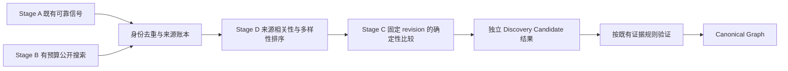

# Discovery V2 RFC — Phase 0

日期：2026-10-09。状态：技术路线评估完成，等待 Review；尚未接入生产。
审计基线：`ab425b6807fc7fdfc3b8c61cf02849b0336c0d49`。所有命令、Git、Node 和测试在 WSL2 Ubuntu-24.04 执行。初始未跟踪的 `tools/` 保留。本轮只增加文档与独立实验，不改 Explorer、响应式、移动端、相机、生产 Graph Schema 或现有采集器。

**建议开发的路线：有预算的外部候选发现 → 独立候选侧车 → exact blob + 严格 token Jaccard + 辅助标识符归一化 → 可定位的匹配片段 → 现有规则验证。** Winnowing 适合作为片段解释的候选工具；本轮没有证据支持用它提升谱系判定。暂不构建全 GitHub 指纹索引，不采用 MinHash 分数替代精确比较，不实现生产 Deep Search 或 AI 调用。

闭集实验支持“复制后重建 Git 历史、格式变化和路径变化仍可被确定性比较找到”。它没有证明能从全 GitHub 找到这些对象：公开搜索的召回率没有穷尽真值，标识符归一化还出现 100% 的通用代码误报。详细数据见 [Benchmark 报告](DISCOVERY_V2_BENCHMARK_REPORT.md) 与 [机器结果](../experiments/discovery-v2/results.json)。

## 1. 当前分析器的能力与局限

### 1.1 Current Capability Matrix

依据实际读取的 [pipeline](../src/pipeline/analyze.ts)、[全部 collectors](../src/collectors/)、[ontology](../src/core/ontology.ts)、[policy](../src/core/policy.ts)、[resolver](../src/core/resolver.ts)、[limits](../src/platform/limits.ts)，以及 [evidence model](evidence-model.md)、[relationship ontology](relationship-ontology.md)、[UI Contract](UI_CONTRACT.md)、[Motion Contract](MOTION_CONTRACT.md) 和现有测试。下表“验证”描述现有实现，不代表推荐扩大其语义。

| 能力 / 来源 | 候选从哪里来 | 当前验证和边界 | 关键源码 |
|---|---|---|---|
| GitHub fork metadata | repository parent/source；parent 优先 | `fork=true` 的 metadata 支持 VERIFIED `forked_from`；不发现重建历史的副本 | [metadata](../src/collectors/github/metadata.ts)、[analyze](../src/pipeline/analyze.ts) |
| README / documentation | 当前树中匹配路径的 GitHub 链接 | 特定英文归属短语可给 DECLARED；普通引用只给 references，不证明派生 | [attribution](../src/collectors/documents/attribution.ts) |
| Package manifests | 支持的 Cargo.git / Poetry.git 等 source URL hints | 包依赖并非一律进入候选；npm git/github/file specs、部分 PEP508 direct URL 不被当前解析器覆盖 | [manifests](../src/collectors/packages/manifests.ts)、[collector](../src/collectors/packages/collector.ts) |
| Registries | npm / PyPI 返回的源码仓库 URL | 解析 latest metadata，而非保证对应依赖锁定版本；失败可能返回 null | [registry](../src/collectors/packages/registry.ts)、[resolver](../src/core/resolver.ts) |
| Submodules | `.gitmodules` URL | 配置事实支持 uses_submodule；不是宿主的派生证据 | [submodules](../src/collectors/submodules/collector.ts) |
| Git history | **已知候选**的有限 Git fetch | 共享 commit 支持 shares_history；满足既有包含关系规则才产生 derived_from；不遍历未知仓库 | [history](../src/collectors/git/history.ts)、[git platform](../src/platform/git.ts) |
| Exact blob identity | **已知候选**的当前文件树 | 相同非空 Git blob 支持 `shares_exact_content_with`；不证明方向，不扫描所有历史版本 | [blobs](../src/collectors/git/blobs.ts)、[analyze](../src/pipeline/analyze.ts) |
| GitHub Search | 无 | client 只有 metadata / commit / tree / file；pipeline 没有 Repository Search、Code Search、反向引用或 fork network 枚举 | [client](../src/collectors/github/client.ts) |
| `similar_to` / `token_fingerprint` | ontology 已预留 | 仅 DETECTED 的合法类型与字段合同存在；没有可运行生产指纹检测器 | [ontology](../src/core/ontology.ts)、[policy](../src/core/policy.ts) |
| 候选去重、截断 | owner/name map，累积 reasons | 候选按 fullName `localeCompare` 排序，默认取前 12；没有相关性评分、来源保留配额或覆盖率排序 | [analyze](../src/pipeline/analyze.ts) |
| Graph 合并 | canonical entity / relationship / evidence identity | resolver 确定性合并和排序；policy 约束类型、状态、方向、必填证据；相似分数不能升级 VERIFIED | [ids](../src/core/ids.ts)、[resolver](../src/core/resolver.ts)、[policy](../src/core/policy.ts) |

去重应再区分候选阶段的 owner/name 与 Graph 的 canonical identity：Graph 会规范化身份，但候选不能仅靠名称解决仓库重命名、转移或别名。未来优先保存 GitHub repository ID，再保存 canonical fullName、别名与完整 revision；所有 discovery reasons 都保留。当前 `candidatesAnalysed` 表示进入有界列表的数量，不等于完成了代码验证的数量。

manifest 解析入口实际支持 package.json、package-lock.json（direct dependencies）、pyproject.toml、requirements*.txt、Cargo.toml、go.mod；并非所有 lockfile。Go GitHub module 会直接产生 repository depends_on，但当前只有 sourceUrlHint 加入候选，因此“图上有依赖仓库”不保证该仓库进入代码比较池。Registry 仅 npm/PyPI runtime facts，不为所有生态提供仓库反查。

合同与行为交叉检查包含 [contract tests](../test/contract.test.ts)、[lineage signals](../test/lineage-signals.test.ts)、[pipeline tests](../test/pipeline.test.ts)、[artifact versioning](../test/artifact-versioning.test.ts)、[manifest tests](../test/manifests.test.ts)、[Git isolation](../test/git-isolation.test.ts) 与 [shared history diagnostics](../test/shared-history-diagnostics.test.ts)。其中已有 assertions 不能消除下文源码完整性缺口；测试 PASS 不是全覆盖声明。

### 1.2 实际覆盖与资源限制

| 默认边界 | 召回 / 成本影响 | 实现位置 |
|---|---|---|
| 候选 12、blob comparisons 12 | 名称靠后的高价值候选可能被截断；未比较不能解释为不相关 | analyze / limits |
| documents 40 files、256 KiB/file、line 4000、200 URL matches/file | 非匹配路径、超长行、超大文件、未读文件和非英文表述会丢线索 | attribution / analyze / limits |
| references 40 | 实现是每份文档传入 scanner 的上限，而非 limits 注释宣称的整个分析统一额度 | attribution / limits |
| manifests 默认 24 files、2 MiB/file、400 dependencies | 文件选择和依赖上限不是整个仓库扫描；registry 仅首批排序后的 25 项 | analyze / manifests / registry |
| submodules 200 entries、128 KiB | 配置超限会损失成员；无递归全网探索 | submodule collector |
| recursive tree 120000 entries | GitHub 本身还可能返回 truncated；下游不能假设拿到了全树 | GitHub client / limits |
| history 默认 depth 200，fetch clamp 1–2000 | 无交集只能表示该窗口未发现；不能证明不存在共同历史 | git platform / history |
| blob 每树前 8000、证据样本 25 | 重复 blob 合并成代表路径；只比较当前选定树，不做历史模糊比较 | blobs / limits |
| entities 2000、relationships 5000、evidence 20000 | Graph 总量有界，丢弃情况需和候选覆盖分开记录 | resolver / limits |
| HTTP 20 s、8 MiB、最多 2 次 retry、rate-limit wait 5 s | 最多三次请求尝试；单请求配置不是整个任务预算 | http / limits |

上述主要是默认值；并非所有 options 都被统一夹到全局硬上限。HTTP 构造器的 redirect 默认值为 3，而 limits 声明为 0；不要把声明表当作所有执行路径的实际预算。Git fetch 有 120 s 进程期限、输出限制和 fetch 后缓存大小检查，但后者不能保证下载过程的硬字节上限。Deep 必须独立实施统一预算，不能复用这些值后宣称已有完整成本控制。

Exact blob index 的实际过滤仅排除 size=0，没有排除 trivially small、license、vendor、模板或非源码，尽管注释声称排除小片段；重复 hash 只保留一个按路径排序的代表。因此该能力验证的是内容相等，不是“独特源码大量共享”。`all` blob mode 也仍然只比较已经发现并成功读树的候选，不能主动检索未知仓库。

### 1.3 两个需要独立验证修复的源码风险

1. **浅历史完整性判断有缺口。** `fetchShallowHistory` 以 `commits.length >= depth*5` 计算 `truncated`，另外返回 `isShallow` / boundary；history 的包含关系规则只看 sample.truncated。正常 depth=200 的浅 fetch 得到约 200 commits 时，可能 `truncated=false` 但仍存在浅边界。不能因此说“完整历史已经包含”。这是基线风险，本轮不修改证据规则；进入生产 Deep 前应先有失败测试和独立修复，要求真实 revision / 边界完整性证据。[git](../src/platform/git.ts)、[history](../src/collectors/git/history.ts)
2. npm registry 的 unscoped name URL 路径会加 `_` 前缀，有导致查询失败、候选漏失的风险。这里仅是源码发现，**未做该路径的在线验证**，不声称已经复现；须单独用固定 package 的正反请求验证。[registry](../src/collectors/packages/registry.ts)

另有 snapshot 风险：Git fetch 的 HEAD 与 GitHub API 的 commit/tree 不保证同一个瞬时 revision。新比较器必须使用固定 commit，不把移动 HEAD 和另一个时间的树混合成一个“样本”。

### 1.4 缓存与“没有发现关联”的解释

[HTTP](../src/platform/http.ts) 使用 URL + Accept 的缓存键与 ETag；304 节省响应体但仍有网络请求，不能算零 API 成本。[AnalysisCache](../src/pipeline/cached-analyze.ts) 验证 Graph 合同并缓存产物；有 `probeRevision` 时才走已知 revision 的命中路径。Web revision probe 仍需要 metadata / commit 请求。Git bare cache 会重新 fetch。public/private namespace 分离，当前 private namespace 明确未实现。

[graphArtifactPaths](../src/platform/git.ts) 路径使用短 commit 和 schema version；没有把 analyzer version、扫描参数、预算 profile 全部纳入键，尽管注释描述更强的隔离。不要将未来 Deep 或指纹算法结果塞进现有 Graph 缓存。新侧车键需要完整 revision、方法/解析器/过滤器版本、预算 profile、搜索 query/时间/TTL、provider 与身份隔离；图缓存保持 Standard 的兼容行为。

没有来源声明、history 重建、未支持的 manifest、registry 失败、文件/树/候选截断、浅历史无交集、Git 不可用、blob lineage-only 排除、API 失败或不完整缓存，均只能表示**未覆盖或未发现**。目前 blob 默认只对已经有 fork/derived/history/submodule 关联的候选启用；因此尤其容易漏掉“完全未声明的副本”。候选树的 blob 路径还依赖 root / candidate history 成功。`enableGit=false` 也不是全路径零 Git 操作承诺：rootHistory 的加载位置在部分开关检查前。必须报告实际完成的阶段，不能把空图当作“不存在关联”。

## 2. Candidate Discovery 新架构



阶段编号表达职责，不强制先比较全部候选再排序。先廉价检索、去重、来源排序，再对有预算名额的候选比较；代码相似性可参与复排，但必须单独显示。

- **A Existing Signals：**保留现在全部可靠采集来源与证据规则。未满足规则的 Git / blob 不从零生成候选；标记该限制。Standard 行为保持；Deep 的 A 结果可以进入候选侧车且记录已存在证据引用。
- **B External Discovery：**从目标的名称、描述、语言、manifest 特征、少量有辨识度的 token/literal 生成有限 query；来源是 Repository Search、带 fork:true 的 repository search、fork list 和 Code Search。文件结构由有界 getTree 验证，不能声称 repository search 已搜索结构相似。先避免秘密、生成物和模板 query；不自动全量递归“候选的候选”。
- **C Deterministic Similarity：**固定 revision、过滤 vendor/generated/lock/license/minified/过短与高频片段，分别报告“过滤”和“失败”。按语言适配器解析 source tokens，保留严格与归一化两份；exact blob、shingle Jaccard 和位置解释。过滤器本轮仅是方案，没有经实验校准。
- **D Ranking：**A 的可靠来源保留名额，B 来源配额与仓库去重后做相关性排序。归一化代码相似性不替代 A 的证据。外部搜索成功但代码无法读取，仍是候选，状态 inconclusive。

接口边界：`DiscoveryProvider.discover(context, budget, signal)` 产生 candidates 和 coverage；`SourceSnapshotProvider.readFiles(identity, fullRevision, budget)` 固定数据；`SimilarityAdapter.compare(snapshotA, snapshotB, methodVersion)` 返回独立 measurements；`VerificationAdapter.verify(candidate, existingPolicy)` 产生已有规则允许的 observations，交由原 resolver/policy 接收。只有最后一层能申请 Graph 写入。每层都接受 AbortSignal，不直接访问 UI 或共享未经隔离的缓存。

## 3. 数据来源、合法性、配额与成本

### 3.1 GitHub 可实际调用的能力

本轮对两个仓库 query、一个已知仓库代码 query、fork list、public metadata / commit / raw file 做了有界 GET。认证从已有本机凭据解析，未输出或保存 token。初次 21、补齐 README 和共同 commit 后 24，共 **45 请求**；两份收据保留，不能只报最终 24。[initial receipt](../experiments/discovery-v2/api-probes-initial.json)、[final receipt](../experiments/discovery-v2/api-probes.json)

| 来源 | 实测 / 文档能力 | 限制与解释 |
|---|---|---|
| Repository Search | 两个认证 GET 200，各仅首屏 5 个；名称 query 混入不相关结果，描述 query 找到 promise/concurrency 项目 | name/description/readme/language/topic 等元数据检索，不是全网相似代码索引；词匹配不是精确仓库名 |
| REST Code Search | 认证 GET 200，已知 p-limit 仓库内找到 index.js / test.js；匿名 GET 401 | 本次仅证明已知 repo 的 token 查询可用，没有实测全网未知副本的召回；REST 走 legacy backend，不等于网站新搜索 |
| Fork list / network metadata | oldest/1 返回 jucke/p-limit；metadata 明确 parent，fork commit 在 upstream commit endpoint 可读取 | 可找到 GitHub 保留的 fork；不能找回已经删除关联、镜像或 reinit 的所有副本 |
| Reverse references | 可有限使用 `"owner/name" in:readme` 或 Code Search 查引用，再解析内容 | 无“全网所有反向引用”完整 API；依赖默认分支、索引和关键词，引用本身不证明 lineage |
| raw / metadata / trees | 固定 commit 文件和许可证合法公开获取 | 公共可访问不等于可无限镜像；保留原许可证、来源、revision、hash；不要执行第三方代码 |

官方 [REST Search](https://docs.github.com/en/rest/search/search?apiVersion=2022-11-28) 说明：单 query 至多可取得 1000 结果、per_page 上限 100；搜索超时可能返回 `incomplete_results`。一般认证 search 30/min、匿名 10/min；认证 code search 单独 10/min。本轮 headers 确认 search limit=30、code_search=10；匿名 code endpoint 的 401 为实际可调用性判断依据，不能靠某些文档模板的匿名说明承诺可用。

REST code 检索有默认分支、小于 384 KB 文件、必须含检索词、query 长度 / 操作符与仓库覆盖限制；索引未覆盖、未索引新 revision、截断与 timeout 都要记录。官方 [gh search code](https://cli.github.com/manual/gh_search_code) 明确使用 legacy backend，与 Web Code Search 不一致，不可把网站 regex / symbol 能力当成 REST API。[仓库检索限定词](https://github.com/github/docs/blob/main/content/search-github/searching-on-github/searching-for-repositories.md)、[fork API](https://docs.github.com/en/rest/repos/forks)

[GitHub rate limits](https://docs.github.com/en/rest/using-the-rest-api/rate-limits-for-the-rest-api)：常见认证 REST primary 5000/h、匿名 60/h/IP；另有 secondary 并发、points、CPU 限制。以响应 resource/remaining/reset 与 retry-after 为准。不得用多个身份绕过配额。GET 请求数、扣额 resource 和实际响应体分别计数；raw 文件没有 primary rate header，不能当作 core 消耗。此次收据 remaining 非单调，可能有共享凭据并发/不同窗口，**不能把前后 remaining 差当成本任务精确扣额**。见报告分类计数。没有付费 API 调用；没有进行 rate-limit 压测。

### 3.2 其他公开索引

- [Sourcegraph streaming API](https://sourcegraph.com/docs/api/stream-api)：文档有 public SSE 搜索示例、`count:n` 停止检索与 progress/skipped 信息。**本轮未验证当前 public 服务可用性、索引覆盖或额度**；只能作为未来 provider 备选。上线前查服务条款、认证、限制和授权，不承诺免费或完整覆盖。
- [BigQuery public datasets](https://docs.cloud.google.com/bigquery/public-data)：需要项目，用户承担查询处理费用，免费额度有条件。特定 GitHub dataset 的存在、许可、最后快照与语言覆盖需单独验证；本轮未执行查询，不将历史公开数据当作当前全 GitHub。仅用于经预算授权的离线索引研究。
- 不使用网页抓取绕过 code search 认证，不构建无界镜像，不接入未验证的商业索引。公开源码实验遵守 pinned MIT licenses；其他来源需逐数据集核实许可和保留要求。

## 4. 相似性方法比较与选择依据

下表成本和鲁棒性是方法适用性评估；只有 exact / 两种 token Jaccard / MinHash64 / Winnowing 在本轮实测。AST 与结构指纹没有实验成绩。

| 方法 | 能发现什么、改名/格式鲁棒性 | 误报与开销 | 索引 / 跨语言 / 解释 |
|---|---|---|---|
| Exact blob | 字节相同；路径变化无影响，格式/内容变化即失配 | 很低比较成本，但 license/template/vendor 完全相同也不能说明宿主血缘 | 候选树即可，语言无关；hash + pinned 两端文件最清晰 |
| Source token normalization | 去 trivia 抵抗格式；全 identifier 归一化抵抗改名 | 泛化越强越容易把短通用代码压成相同结构；解析有线性输入成本 | 每语言 tokenizer/parser；不是跨语言语义；保留原 token offset 与版本 |
| Token shingles + exact Jaccard | 局部连续 token overlap；路径无关，改名使用辅助归一化版本 | set 内存随 token 增长；模板、高频片段与极短文件需过滤 | 小候选池直接 pairwise；大规模需索引；解释相交 shingles、长度与双方覆盖 |
| MinHash | 估计 shingle 集合 Jaccard，便于大候选池预筛 | 有估计误差；本轮 seeded SHA64 比直接 set 比较更贵，未产生额外召回；模板误报不消失 | 可配 LSH 但须建索引；语言能力继承 tokenizer；最终仍需原文件精确验证 |
| Winnowing | 连续匹配的稀疏位置指纹，适合定位片段 | 对重排/修改仍可能丢匹配；归一化通用片段误报照样 1.0 | 候选内比较或倒排索引；保留位置便于解释；不是语义/跨语言证明 |
| AST comparison | 同语法下结构/部分改名变化；可做 binding-aware 分析 | parser 适配、错误恢复、树匹配和节点映射成本更高；常用结构同样误报 | 需语言专用 AST / index；跨语言需额外抽象层，未实现、未测；可给节点/行段 |
| 文件树 / 模块结构指纹 | 路径层级、扩展名、入口/依赖等廉价预筛 | 改路径鲁棒性取决于抽象；脚手架使相似高，不证明来源 | 元数据索引即可，部分语言无关；解释命中的目录/模块特征 |
| exact + fuzzy 混合 | byte 相等与修改后 overlap 分开显示 | 不叠加成 lineage probability；各信号共享模板偏差 | 固定 revision 与多文件覆盖；exact 事实和 fuzzy 测量分别存储 |

原始 [Winnowing 论文](https://theory.stanford.edu/~aiken/publications/papers/sigmod03.pdf) 的局部匹配保证依赖相同归一化序列和 k/w 等假设；本轮 k=5,w=4 选 rightmost minimum，保证条件对应长度至少 8 tokens 的共享片段，**不是“8 tokens 就有来源关系”**。[Broder near-duplicate 研究](https://research.google/pubs/identifying-and-filtering-near-duplicate-documents/) 支持集合相似的 sketch 路线，不提供本产品误报率保证。

[SourcererCC 原论文](https://arxiv.org/abs/1512.06448) 展示 token 倒排与过滤可支持大规模 clone detection；[NiCad 原论文](https://research.cs.queensu.ca/home/cordy/Papers/RC_ICPC08_NICAD.pdf) 采用语言专用解析、pretty-printing 和 normalization，再作文本比较。两者说明规模化和 parser 路线都需要独立适配与评估；NiCad 不是本轮实现的 AST 树匹配，不能借其成绩给本产品背书。

最小组合：exact blob + strict-token 5-shingle Jaccard 为可解释基础，normalized Jaccard 仅辅助召回；Winnowing 只用于 Review 中片段定位的实验入口。生产版本应改为 binding-aware 归一化（保留属性/import/字面量区别）、加入最小有效 token、多文件/非模板占比与高频片段过滤，再扩大语料校准。**暂不选单阈值自动通过、不选 MinHash/LSH 全站索引、不选完整 AST 相似引擎。** 当前数据足以开发比较 sidecar，却不足以选择生产判定阈值或宣称真实未知关联召回。

## 5. 候选排序方案

三个值始终分开：`relevance`（为什么值得比较）、`similarity`（怎样的代码 overlap）、`verification`（哪些事实检查完成）。实际 lineage claim 只来自既有 policy 接受的证据，不来自加权分数。

1. A 来源优先保留，Deep 名额中为 fork/history/明确归属和依赖/引用分别保留配额；新增搜索候选不能挤掉可靠源。Standard 不在本轮改变现有输出。
2. B 按来源相关性 + 语言/元数据特征 + query 特异性做稳定排序，按来源分层轮询，避免一个热门 query 占满。建议初版用可解释序列键：来源层级、独立来源数量、稀有特征匹配数量、元数据一致性；每项列出 reasons。若后续数字加权，公开版本与权重，称 relevance points，不称概率；权重未经本轮校准。
3. 拿到代码后单独复排：有效非模板覆盖、多文件一致性、严格/归一化 Jaccard、exact 匹配；unknown 不晋升 verified。候选大小差异与包含度另外报告，不能只用 Jaccard 低分删掉旧 fork。
4. 完整 GitHub ID 去重，所有来源保留；同分用 canonical ID 的固定 codepoint 次序，固定 query plan 和 revision，避免 locale 改变。明确记录 pending / dropped 候选与理由。

每个结果都能回答“由哪个查询/文件发现、因何获得名额、读了什么、哪些没读”。分数排序只帮助审核候选；不会生成 derived_from、forked_from 或“抄袭”结论。

## 6. Discovery 与 Verification 合同边界

候选合同是独立设计草案 `discovery-candidate@1`，**本轮没有修改生产 schema 或写入代码**。现有 Graph schema 2.0.0 与 VERIFIED / DECLARED / DETECTED 合同保持。即使 ontology 已允许 DETECTED similar_to，本轮实验也不向 Graph 写这类边。

```ts
// RFC sketch, not a production type
interface DiscoveryCandidate {
  schemaVersion: 'discovery-candidate@1';
  target: RepositorySnapshot;
  candidate: RepositorySnapshot; // provider, stableRepositoryId?, fullName, aliases, fullRevision?
  discoveries: Array<{
    source: string; sourceVersion: string; reason: string;
    query?: string; observedAt: string; locator?: string;
    rankInSource?: number; receiptId: string;
  }>;
  relevance?: { value: number; scale: string; methodVersion: string; components: unknown[] };
  similarity: Array<{
    method: string; version: string; parserVersion: string; filterVersion: string;
    score?: number; scale?: string; // omitted if unavailable, never invented zero
    files: Array<{ sourcePath: string; targetPath: string;
      sourceRevision: string; targetRevision: string;
      sourceDigest: string; targetDigest: string;
      fingerprint?: string; sourceRange?: [number, number]; targetRange?: [number, number] }>;
    measuredTokens: number; matchedTokens?: number;
    coverageId: string; // denominator, excluded files and failure/truncation details
  }>;
  verification: {
    state: 'pending' | 'checked' | 'inconclusive' | 'rejected';
    checks: Array<{ kind: string; outcome: string; evidenceIds?: string[] }>;
    canonicalEvidenceIds: string[]; // references to accepted facts, not automatic lineage
  };
  lineageClaim: 'none' | 'declared' | 'accepted_by_existing_policy';
  coverage: Array<{
    stage: string; state: 'complete_within_budget' | 'partial' | 'unavailable' | 'disabled';
    examined: number; knownEligible?: number; totalUniverse?: number;
    truncated: boolean; reasons: string[]; pending: string[];
  }>;
  usage: { requests: Record<string, number>; attempts: number; receivedBytes: number;
    wallMs: number; cpuMs?: number; gitBytes?: number; cacheHits: number;
    rateHeaders: unknown[]; estimatedMoney?: { value: number; currency: string; basis: string } };
}
```

运行时 validator 需验证 score 区间、两端 identity/revision/digest、method/filter/seed 参数、coverage 引用与资源预算。unknown / unavailable 不用 0 替代。`checked` 仅表示 checks 完成，不等价于 VERIFIED。exact blob 只能申请已有 shares_exact_content_with 事实；共享 SHA 只能按现有 history 规则申请相应事实；派生方向需要独立证据。不足以形成图边的候选仅保存侧车，未来列表/图层也明确“待核实”；本轮不实现 UI。

## 7. Standard / Deep / AI-assisted 成本模型

| 模式 | 请求和计算 | 缓存 / 输出 | 本轮状态 |
|---|---|---|---|
| Standard 默认 | 保留现有 deterministic collectors；无 search / AI 新调用 | 原 Graph 与缓存行为，不引入新 fingerprint 开销 | 只审计，未改变 |
| Deep 显式开启 | 搜索 + 固定文件比较，独立请求/CPU/时间/候选额度 | 独立 discovery cache、阶段覆盖与未完成列表；验证满足条件才进入旧图 | 设计，无生产实现 |
| AI-assisted 未来可选 | 用户 BYOK；语言提取、功能理解、query/候选建议 | 建议带模型版本/输入摘要/费用收据；可删 AI 输出重跑 deterministic verification | 仅边界，无 Key/账户/计费/API 实现 |

未来首个 Deep 实验 profile（**提议预算，不是本轮实测成本，也未在生产执行**）：总请求尝试 ≤40，其中 search ≤4、code_search ≤2、core/raw 共享其余名额；候选 ≤16，每仓库 ≤16 source files；单文件 ≤128 KiB、全任务读取 ≤8 MiB；wall ≤120 s、worker CPU ≤10 s、并发 ≤2；Git 阶段默认禁用，可另行申请明确深度、下载与时间额度。所有 retries/ETag/分页均计入总 attempts；缓存命中只有真正不联网时才计零请求。无 page 全自动遍历。预算由 reservation 在发请求/读 chunk/启动 worker 前扣账，用 abort+worker 终止停止后续任务，报告剩余 pending。CPU 和 Git 网络硬预算须执行层验证，不能仅 fetch 完成后检查大小。

成本关系：`总成本 = revision probe + 非缓存来源检索尝试 + 文件读取尝试/字节 + token处理 + 比较 + 独立验证`；数据量/索引命中决定延迟，没有凭空给出“单仓库生产价格”。本轮每仓库仅一个文件，离线成本见报告，不能按 9 个小文件线性外推大仓库。

AI provider 只接收用户批准的最小公开内容与 DiscoverySuggestion 合同；Key 留在专用凭据层，不进入 Graph、日志、缓存、浏览器持久存储。模型输出是未信任候选；它不能设置 verification 状态或生成 lineage accepted 标记。未来独立 token/currency budgets 和 cancellation 接口，不依赖当前 API key UX。

## 8. Benchmark 数据与指标

入口 [benchmark.mjs](../experiments/discovery-v2/benchmark.mjs)，环境 Node 24.21.0 / TypeScript 5.9.3 / Linux。四个真实 public MIT 仓库固定完整 SHA，每仓库一个 index.js；已知 fork 标签同时有 parent metadata 和 upstream 可读的 fork commit，两个真实未知候选标签始终 unknown。三个程序构造变体标 positive，仅代表已知复制/转换来源，不是假装真实未知项目。另有两个闭集负候选和两个对抗性 negative pairs。

- 9/9 文件完成，仅表示固定池 coverage=100%；全网 discovery coverage / Recall 没有真值，无法测量。
- exact blob Recall@5=25%；strict / normalized / MinHash64 / Winnowing Recall@5=100%（4 个已知正例）。这只是闭集排序，阈值未校准。
- 四个 fuzzy 的 Precision@5 范围 80–100%，因为返回一个 unknown；不能报告“真实 precision=100%”。`precisionJudged` 另有定义，与固定 K precision 不同。
- 通用校验函数独立编写对：normalized / MinHash / Winnowing=1.0；共享第三方模板对所有方法=1.0，却不代表宿主间派生。Winnowing 还把 p-throttle unknown 排在真实旧 fork 前。
- 离线 API / rate-limit / paid calls 均 0；联网获取与接口研究总 45 GET 单独记账。成本、延迟、分类调用、全 SHA、原许可证、hash、README 检查范围、命令和回放限制见 [完整报告](DISCOVERY_V2_BENCHMARK_REPORT.md)。

缺少真实 reinit 项目的人审标签、更多语言、多文件模板负例、改控制流/算法/混淆样本、外部检索 gold pool、冷/热缓存多次分布，因此不足以定生产阈值、误报率或全网覆盖率。停止条件满足的是“选出值得进一步开发的有界实验路线”，不是“新引擎效果已被证明”。

## 9. 渐进实施与回滚

1. **下一最小切片：**实现独立 Candidate contract validator、budget ledger、固定 revision source adapter 和离线比较 sidecar；默认关闭，输入固定候选 pool，输出 JSON，不修改 Graph / Explorer。用当前正负对与 parse/budget/unknown 测试验收；加多文件/高频模板语料与 binding-aware 归一化对照。先证明拒绝误报和可解释覆盖，再接搜索。
2. 单独修复并回归浅历史完整性风险；验证 npm URL 风险；不借候选引擎放宽已有 VERIFIED 条件。
3. Review 后接 Repository Search / fork providers，有限 query plan、来源配额、identity 去重，完整记录 incomplete/pagination/remaining；把每个候选保留为 unknown，人工判定 gold set。
4. 再接 Code Search adapter（有 token 才可用）和有预算 similarity worker。对人审数据测 Recall@K / Precision@K、覆盖、冷/热成本和 timeout，校准保守过滤策略。之后才讨论生产 Deep 与候选 UI。
5. AI suggestion provider 最后接入；BYOK/计费/隐私另行 RFC 和授权，始终不能作最终裁决。

回滚：本轮删除实验/文档提交即可，生产文件未改。未来 flag 默认 off，cache namespace 独立；禁用/撤回 provider 和清除 discovery cache 不影响 canonical graph cache。保持旧 analyzer 可运行，不做不可逆 schema migration；将已接受的既有证据和实验候选分开存储。未通过人工/契约验收不发布生产 Deep。本轮无 push / deploy。

## 10. 未解决风险与 Review 决策

- 外部索引覆盖不可知：Repository/Code Search 不是全网 clone detector，无关键词命中的副本可能完全漏失。
- 标识符归一化/模板使 similarity 极高，历史重建也不证明原作者或传播方向；不要作抄袭判断。
- 旧 fork 与当前 root 版本差异很大，Jaccard 低；不能简单阈值排除真实共同历史。
- 小 JS 单文件数据不足以评估 parser 支持、跨语言和大型仓库成本；实验转换甚至改 import/property 名，不保证代码仍可执行。
- Primary headers 不能精确归因本任务扣额；secondary throttling、认证不可用、网络失败均要保留收据和未完成状态。
- 浅边界、registry URL、snapshot/caching 参数风险属于基线，必须分别处理；本轮没有宣称已修复。
- 查询/缓存可暴露用户意图；未来 private repository 与 BYOK 需独立权限和存储设计。

请 Review 是否接受“独立候选侧车 + 有界检索 + 严格 token 为主 / 归一化辅助 / 可定位证据”的实验路线，以及下一切片的边界。当前结果不支持开启生产 Deep Search、不支持设定自动 lineage 分数阈值。本轮完成后停止。


## 11. Phase 1B implementation addendum (2026-10-09)

Phase 0/1A conclusions above are historical experiment records and remain unchanged. This stage implements only independent public Repository Search discovery. See [Phase 1B report](DISCOVERY_V2_PHASE1B_REPORT.md) and [reproduction](../experiments/discovery-v2/PHASE1B_README.md).

Architecture: fixed target full SHA → deterministic query plan (<=4 queries) → controlled RepositorySearchProvider → numeric GitHub ID deduplication and observed alias provenance → discovery-only v2 sidecar. No production analyzer import, Graph Observation, similarity execution, fetch/clone, cache integration or UI.

The official [Search API contract](https://docs.github.com/en/rest/search/search) permits public Repository Search without authentication, per_page up to 100, at most 1000 accessible results, and incomplete_results. Search is repository metadata matching, not a code similarity index; our stricter experiment permits per_page<=25 and pages<=2. Official documented search budgets are 10/min anonymous and 30/min authenticated, with runtime headers authoritative. The provider pins supported `2026-03-10` [API version](https://docs.github.com/en/rest/about-the-rest-api/api-versions). [Primary/secondary limits](https://docs.github.com/en/rest/using-the-rest-api/rate-limits-for-the-rest-api) require stopping rather than unlimited retries. No Code Search or additional public index is implemented.

Queries prioritize repository name, first three filtered description terms, explicit topics, then caller keywords with sources. Optional language restricts all queries; ASCII input, lengths, qualifiers and obvious credential strings are validated. This deliberately misses one-character/non-ASCII names and synonyms. Query relevance is not similarity; this stage emits no numerical score. Results are admitted using per-query shares followed by round-robin fill, preserving all successful reasons and avoiding alphabetical truncation. With fewer slots than sources, deterministic source order still determines coverage.

`discovery-candidate@2` is separate from v1: provider ID, response-proven names/aliases, HTML URL, identity observations/conflicts, unresolved revision, discoveries, empty similarity/files, pending verification and no lineage claim. Same ID merges; same name/different ID stays separate and incomplete. Metadata observations can be reconciled by the pure identity adapter, but no metadata HTTP lookup occurs. The latest observed search name is only the best name observed in this run, not proof that remote metadata is globally current. V1 still requires a complete SHA and cannot accept v2 without future explicit resolution. Cost and coverage bind candidates through the enclosing versioned sidecar and query/page receipts.

The Phase 1A ledger now actually guards this new provider without changing its implementation: all HTTP attempts, retries and pages pre-debit total/search attempts, worker capacity and independent conservative response reservations. Source bytes retain their original meaning. Caps: attempts40/search4/candidates16/wall120s/concurrency2; retained body <=256KiB/response and <=1MiB aggregate reservations. First overflow chunk immediately cancels, is neither retained nor parsed, and is reported as delivered overflow. Fetch does not provide a hard wire-transfer/RSS cap. CPU hard limits remain unsupported; no comparison Worker is launched.

Serial page rounds give each planned source a first page before deeper pagination. At most one retry for network/5xx; positive Retry-After stops the run. 401/403/429/redirects stop globally; remaining=0 also stops. Receipts distinguish full bounded execution, budget/provider partiality, unavailable, cancelled and unattempted queries, keep completed candidates, and list unfinished pages. No cache means every experimental run pays its actual GET cost; Standard cost/cache behavior is unchanged. A single live probe is interface evidence, not discovery recall or lineage precision.

Before future production release, independently invalidate or reverify old Graph caches that may retain pre-fix shallow-history containment; this phase deliberately performs no migration. Next slice: resolve a small user-selected set of numeric IDs to verified full SHAs through independently charged bounded metadata requests, then explicitly compare fixed snapshot files using Phase 1A. Unresolved/conflicting identities must remain pending. Rollback is removal of independent Phase 1B modules/experimental entry point; v1, Standard and Graph schema remain intact.


### Phase 1D 实验接口补充（2026-10-09）

公开探针已成功通过 numeric ID Metadata → verified owner/repo → manifest 完整 commit SHA → Tree/Blob 固定 SHA → owner/repo 最终 ID 核实。新默认 SnapshotProvider 使用正式 owner/repo Git 路由，旧数字 ID Git 子路由只保留给注入 transport 的历史 Mock 重放；不依赖它们的真实兼容性。身份转移发生在读取前时使用 ID Metadata 的新名称；读取中名称/ID 变化、301 或 404 时放弃该快照，不自动重启。比较与生产 Graph 仍分离。实际收据、资源使用与限制见 [Phase 1D 报告](DISCOVERY_V2_PHASE1D_REPORT.md) 和 [重放说明](../experiments/discovery-v2/PHASE1D_README.md)。本补充不修改既有 Graph 或 VERIFIED 语义。
