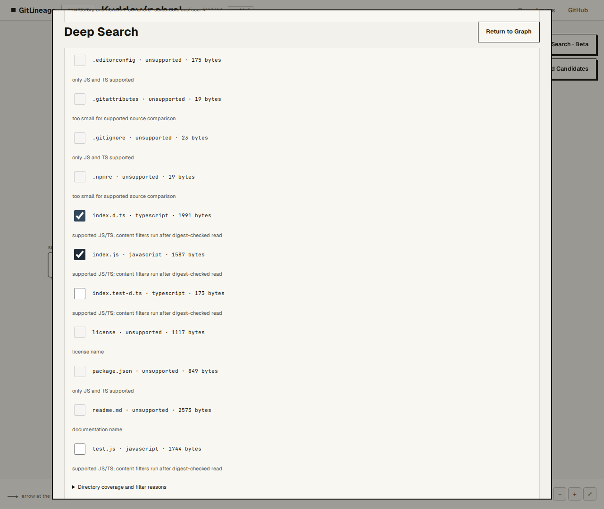
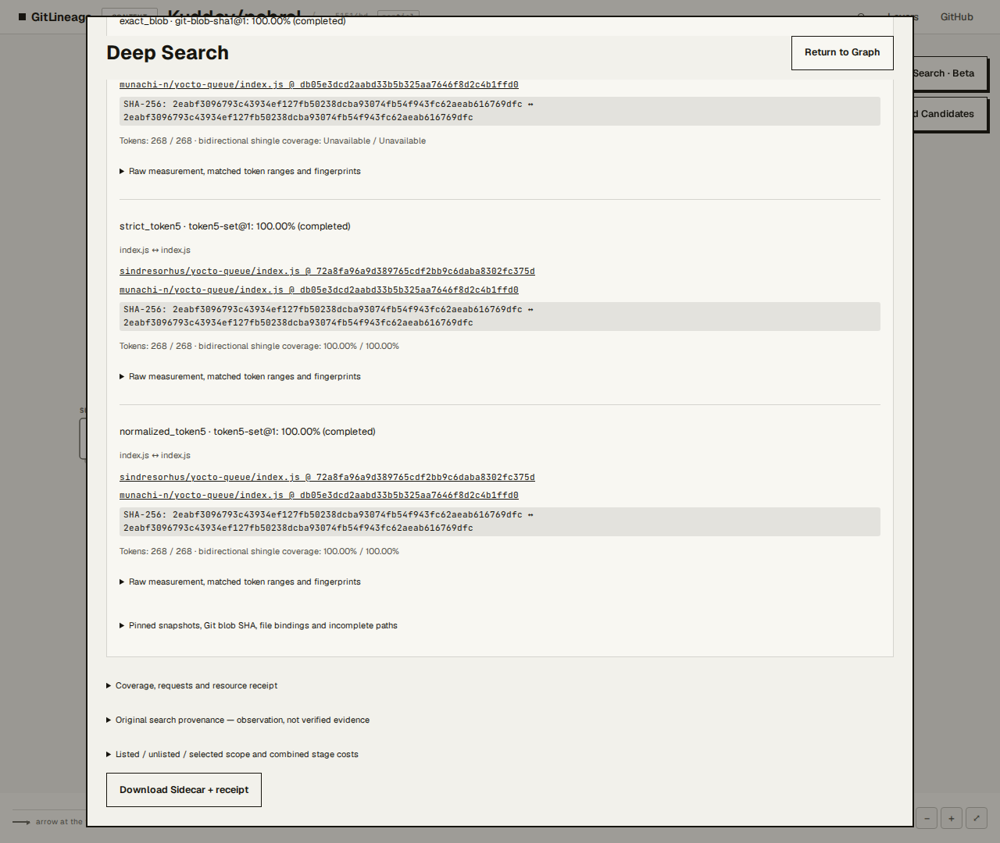

# M2 Release Candidate 验证报告

日期：2026-10-10 
任务指定基线：`801cefc8099365442e35727ae6b60d1a55a8d217`；实际开工 HEAD：`1300ee991bd3eb028e2e716cdef707b9cf98be2d` 
分支：`review/gitlineage-development` 
Draft PR：[#1](https://github.com/yunmin311/GitLineage/pull/1)

## 结论

本轮没有增加产品功能。已为 PR 增加独立 ARM64 / Node 24 验收工作流、生产 Deep Search 默认关闭测试，并完成一次匿名 GitHub 真实多文件比较。比较本身完成，但 Repository Search 只读取了 13 个可访问分页中的第 1 页，因此搜索覆盖标记为 `partial_provider`。候选相似度是源码测量，不是谱系验证。

M2 仍适合显式授权的本地预览，不满足生产发布条件。常规生产 server 和 Docker 启动未注册 Preview Handler：能力接口返回 disabled，Deep Search POST 返回 404。实验预览脚本另需显式 `GITLINEAGE_DEEP_PREVIEW=1`，并绑定 `127.0.0.1`。本轮没有修改服务器、生产配置或 Canonical Graph。

## 自动 CI

新增 `.github/workflows/m2-pr-validation.yml`，由面向 `main` 的 PR 事件触发，运行于 GitHub `ubuntu-24.04-arm`，验证 AArch64 与 Node 24。顺序执行锁文件安装、Typecheck、离线 Discovery、Unit、Production Build、生产 Deep Search disabled 检查，以及 Canvas、Landing、Analysis、Preflight、Stale A→B、UI Contract、Responsive、Mobile、Deep Search 浏览器验收。浏览器验收前后比较 `dist/web` SHA-256，避免用测试过程重建的 bundle 冒充生产构建。该工作流不读取 secrets、不运行真实 GitHub API 实验，也不部署。

现有 `arm64-validate.yml` 保持不变：它仍由 main Push / 手动触发，包含不同的联网和构建路径。本工作流隔离 PR 验收，不替代原工作流。

首次 PR CI 在 `1300ee991bd3eb028e2e716cdef707b9cf98be2d` 运行失败，失败发生于 Unit：多个图布局测试依赖本地忽略目录中的 `.cache` / `artifacts/acceptance/*.view.json`，干净 CI checkout 没有这些文件。修复已纳入当前工作：测试改读提交的固定公开 Graph 快照；Browser fixture server 不再读取 `.cache`；元数据模式下 `enableGit:false` 在任何浅克隆前生效；原来标为“离线”的 404 测试改用确定性 Mock Fetch。完整本地 Unit 已重跑通过。推送修复提交后仍需检查 CI 是否在最终 SHA 通过；最终运行 URL 和状态见本次交付说明。

## 真实公开多文件实验

运行时间：2026-10-10 UTC，匿名公开 API；实验在一次明确启动后完成，没有因配额失败而重试。

| 角色 | 仓库 ID | 固定 commit | 固定 tree |
|---|---:|---|---|
| Target | `315531538` `sindresorhus/yocto-queue` | `72a8fa96a9d389765cdf2bb9c6daba8302fc375d` | `0b81d56218d4a4ab1b9ec91109e7b5d493e123d7` |
| Search candidate（未裁定） | `1168938776` `munachi-n/yocto-queue` | `db05e3dcd2aabd33b5b325aa7646f8d2c4b1ffd0` | `9925e53c997bf4590cbab809fc482b74093f3da8` |

搜索使用 `yocto-queue in:name is:public fork:true`，GitHub REST Repository Search v1，第 1 页，返回 3 个项目（排除 target 后 2 个候选）。API 报告 39 项、12 个未抓取的可访问页，故覆盖为 `partial_provider`。搜索结果中的 `fork:true` 只是查询条件；本候选没有被人工裁定，也没有被作为已知 Fork 标签。

两边各显式选择了 `index.d.ts` 与 `index.js`。四个固定路径读取和比较均完成；其中 2 个路径对的 Git Blob SHA 与 SHA-256 完全相同。两个文件分别得到 Strict token5 `1.0`、Normalized token5 `1.0`；总计 352 tokens，strict 309/309 shingles、normalized 281/281 shingles，4/4 文件对已比较，0 失败。结果标签仍为 `unknown; unjudged`，`verification=pending`、`lineageClaim=none`。

源码摘要：

| Path | Git Blob SHA | SHA-256 | bytes |
|---|---|---|---:|
| `index.d.ts`（两仓库相同） | `0475d9853a37ea304cac34ad41b1ac3736447ff3` | `a760662b79da8ff47d9152d25b5641491b036a3762c3cd94645380c9f97288e7` | 1,991 each |
| `index.js`（两仓库相同） | `627ed535f3163b37f2e3b208a23788fd0a715eba` | `2eabf3096793c43934ef127fb50238dcba93074fb54f943fc62aeab616769dfc` | 1,587 each |

资源收据记录 18 次总请求尝试、2 个候选、每仓库 2 个选中文件、合计源码 7,156 bytes、峰值 Worker 1；没有超出并发上限。累计网络预留 `589,824` bytes、接收及保留 `96,080` bytes、overflow `0`；每响应解析/保留上限 32 KiB，总预留上限 1 MiB。比较墙钟约 3.2 秒，CPU hard budget 仍为 unsupported。开始前额度快照为 Core 49/60、Search 10/10；搜索响应报告 Search 剩余 5，比较请求报告 Core 剩余 32。配额数字是 API 响应快照，不用其差值推断由本次任务独占的消耗。

原始独立材料及 SHA-256：

- [完整运行收据](experiments/m2-rc/live/receipt.json) — `56e6dee1fdf5c7d41557b17ad4215de3ec9732ae4c5971dc994e2d0178f1e076`
- [比较 Sidecar](experiments/m2-rc/live/comparison-sidecar.json) — `3f40b85b2fda4b8f547c261ebe0aed1a163ffd4becf9302b97f700dbaf19e461`
- [源码选择页面](experiments/m2-rc/live/source-selection.png) — `cc9baac43e3711d4148098bbcd387c06cd868bc9518beeee978d957b8413f810`
- [比较结果页面](experiments/m2-rc/live/result.png) — `047a9b2fe6a8af562600802015e9c60931aef7a41a57015af30d1da8649c031c`

## 本地回归与浏览器兼容性

实际基线 `1300ee99` 加本轮稳定化改动后的本地回归记录：

- Typecheck、Build、Unit：PASS；Unit 为 566 项（563 pass、3 个既有 skip、0 fail）。
- 离线 Discovery：118/118 PASS。
- Chromium 浏览器回归：Canvas（113/113）、Landing（40/40）、Analysis（16 个状态、0 个 UI contract violation）、Preflight（45/45）、Stale A→B、UI Contract（75/75）、Responsive（71/71）、Mobile（133/133）、Deep Search / Candidate Overlay（21 个验证断言）全部 PASS。
- 视口验收：390、430、1280、1920 px；属于 Chromium 模拟视口，不代表实体手机或触控设备认证。
- 生产关闭检查：真实生产模式 server 的能力接口为 `enabled:false`，Search POST 为 404。
- WebKit：未验证通过。实际运行 `PLAYWRIGHT_BROWSER=webkit npm run test:deep-search` 时，浏览器在测试开始前因 WSL 缺少 `libgstreamer-plugins-bad1.0-0`、`libflite1`、`libavif16` 而无法启动；不把 Chromium 结果外推为 WebKit 结果。
- 本次本地生产构建的关键产物 `assets/app.js` SHA-256 为 `b7efe771a8bf3aadd23c5bd072c85c25cd6250a11e9625c696248a4a4e323d56`，`index.html` 为 `eb986da191714c99480449e78e7b9406d83d34b8fa1dfffbbd85cfde40c7c8ca`。PR CI 会在整组浏览器验收前后对 `dist/web` 全部文件执行 SHA-256 校验，作为浏览器使用正式构建产物的证据；生成时间不同的 build manifest 不用于跨构建比较。

本地 Chromium Deep Search 端到端使用固定 Mock；真实 GitHub 实验材料单独存放，没有被混入 Mock 结果。浏览器测试构建前后 `dist/web` 哈希相同的断言已纳入 PR CI。

## 稳定 UI 与 M2 发布拆分

实测开工 HEAD `1300ee99` 相对 `origin/main` 有 31 个提交。P0/P0.5 稳定 UI 提交形成前 6 个提交的连续前缀，可从 `ab425b6807fc7fdfc3b8c61cf02849b0336c0d49` 建立稳定 UI 审查分支/PR；该点以 `origin/main` 为祖先，不需要重写现有提交。建议先审查并发布该独立前缀，回滚可用普通 revert。此轮没有创建第二 PR，也没有重写既有历史。

M2 功能仍置于 Draft PR #1。常规部署入口不挂接预览处理器；代码中没有把 Deep Search 能力默认开放给生产服务。M2 可继续做本地显式授权预览，但在身份访问控制、WebKit/实体设备验证及 Review 完成前，不建议把实验预览部署到公开生产环境。

## 边界与未完成项

- 未 Merge、Deploy、Push main 或修改 OCI/Caddy/TLS。
- 未执行真实 GitHub API 的 PR CI；PR CI 只跑固定离线测试。
- Search 覆盖为部分分页，不可描述为 GitHub 全面发现。
- WebKit 和实体设备未验证；CI 目前运行 Chromium 浏览器套件。
- 高相似度仅说明选中文件与固定版本的确定性测量，不证明来源、派生或不当复制。
